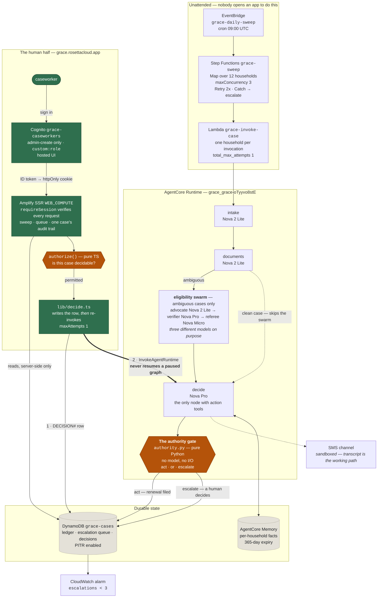

# Grace — architecture

One diagram of the whole system, and then the three claims it exists to support.

Everything below is deployed and running in `us-east-1` unless a note says otherwise. Mermaid renders
natively on GitHub, so this file is the architecture diagram; `docs/deployed-verification.md` is the
evidence that it behaves as drawn.

---

## The system

**The browser never reaches the agent.** A caseworker's decision goes to a server-side route, which
records it durably and *then* re-invokes the runtime — so the request re-enters the graph at `decide`
and the same authority gate runs again on the same case facts. There is no path from the client to
`InvokeAgentRuntime`, and no path that resumes a paused graph.

### The dashboard tier, in the order a request travels

| Step | Component | What it refuses |
|---|---|---|
| 1 | `proxy.ts` (edge) | A request with **no** session cookie → 307 `/login`. *Presence only* — never the security boundary. |
| 2 | `requireSession` → `verifySession` | A cookie whose signature, issuer, audience, expiry, `token_use`, or `custom:role` fails → `null`, then 307. Runs on **every page and the write route**, independently. |
| 3 | `lib/cases.ts` | The only DynamoDB reader. Paginated with a page cap that **throws** rather than truncating, because a truncated Query drops the newest rows — exactly where `renewal_submitted` lives. |
| 4 | `authorize()` | Pure TypeScript, no I/O. A case that is not escalated, already decided, unknown, or whose last run reached no outcome. Session checks run **before** fact checks, so refusal codes cannot enumerate case ids. |
| 5 | `lib/decide.ts` | Writes the `DECISION#` row, then invokes with `maxAttempts: 1` — the call is **not idempotent**, and each retry would re-run the whole graph. |
| 6 | `authority.py` | The gate, unchanged. It has no parameter an approval could occupy. |

---

## What the diagram is claiming

### 1. The gate is the only thing that can permit an action

`authority.py` is pure Python — no model, no `boto3`, no `strands` import, no file or network I/O — and
a test greps for violations. It maps case facts to `act` or `escalate`, and `steering.py` adapts it
into a `SteeringHandler` that runs **before every state-changing tool call**.

Three layers enforce the boundary, strongest first:

1. **Capability absence.** `submit_renewal` is not in the tool list for nodes that must not file.
   `intake` and `documents` receive read tools only. There is nothing to disobey.
2. **Identity from the session.** Every household-scoped read tool takes **no arguments** — the case is
   bound at construction. A prompt injection cannot redirect Grace to another family because there is
   no parameter to poison.
3. **The deterministic gate.** Pure Python, exhaustively table-tested, and it fails closed: any error
   during verification escalates.

**Verified on the deployed system:** four consecutive sweeps returned 9 acted / 3 escalated, and
`renewal_submitted` appears in DynamoDB for exactly `c-001`–`c-009` and for none of
`c-010`/`c-011`/`c-012`.

### 2. Deliberation is real, and it only runs when it is needed

The dotted line from `documents` straight to `decide` is the conditional edge: nine of twelve
households never pay for the swarm. The three that do get an advocate arguing the family qualifies, a
verifier checking each claim adversarially, and a referee deciding whether it is genuinely ambiguous —
on **three different models**, because two instances of one model agreeing proves nothing and nothing
should referee its own argument.

The referee's conclusion is **appended** to the caseworker's brief, never substituted for the gate's
verdict. On a real run the referee concluded *CLEAR* for `c-012` and the case escalated anyway, because
`evaluate()` said `source_conflict`. That is the design working, not a bug.

### 3. A human's approval is an input to the gate, never a bypass

The dashboard's path to `decide` is the sharpest thing in this diagram, and it is now **executed rather
than asserted**.

Resuming a paused agent with any truthy response **approves the blocked tool** — measured against the
real executor, `"needs review"` resumed a graph and filed a renewal for a household missing a required
document. So the deployed path has no resume at all. A caseworker's approval instead becomes a durable
`DECISION#` row, and Grace is re-invoked so the gate re-evaluates the **case facts**.

**Verified on the deployed system:** a real caseworker session approved `c-010`, the household missing
`proof_of_residency`. The route returned `filed: false`, and DynamoDB confirms `renewal_submitted` for
`c-010` is still **0** while the `DECISION#` row records who decided and what Grace did instead. A human
approved, Grace re-checked, the gate refused again.

The guarantee is **structural**: `evaluate(case, today, pack=None)` has no parameter an approval could
occupy, so the flag cannot reach the gate even by mistake. It appends a sentence to the reason a human
reads, after the verdict is already final. Evidence in
[`dashboard-verification.md`](dashboard-verification.md#3-the-approval-that-files-nothing--the-whole-safety-argument-executed).

---

## What is deliberately not here

| Not built | Why |
|---|---|
| **AgentCore Gateway** | The largest remaining chunk and the most common deploy-day failure. The `target___tool` prefix bug that would let a gateway tool bypass the gate stays fixed and tested in `steering.py` regardless, so adding Gateway later cannot silently reopen it. |
| **Real SMS delivery** | The account is sandboxed: `MaxLimit: 1`, zero origination numbers, and Egypt sender-ID registration needs a letter of authorization, company registration, and a tax card. `TranscriptChannel` is the always-works path and the demo never depends on SMS. |
| **CloudWatch trace correlation** | Every ledger row carries a `trace_id` key, but its value is `NULL` in the deployed runtime: Runtime injects the OTEL environment variables without installing an in-process tracer provider, so zero spans exist. Fixing it would require `aws-opentelemetry-distro`, which is forbidden here. `NULL` is honest, and the DynamoDB escalation queue is the demo's evidence instead. |

**Four AgentCore surfaces are in use** — Runtime, Memory, Identity (the Cognito pool whose ID token is
the dashboard's trust anchor, *not* a Gateway JWT authorizer), and the deploy harness. Never five.

---

## The observability claim worth making

The alarm is on **escalation count below three**, not on error rate.

The failure this system exists to prevent is *acting when it should have escalated*. That produces no
error, no throttle, and no latency spike — it looks exactly like success. Standard `SystemErrors`,
`Throttles`, and p99 latency alarms are worth having as hygiene, and **not one of them would have
caught any of the defects found while building this.** So the alarm watches the invariant instead: the
fixture set is twelve households, three of which must escalate, and a sweep that escalates fewer is a
gate that got looser.

Verified on real data: after a sweep, `Grace/EscalatedCases` published `Sum=3.0` and the alarm went
`OK`.
